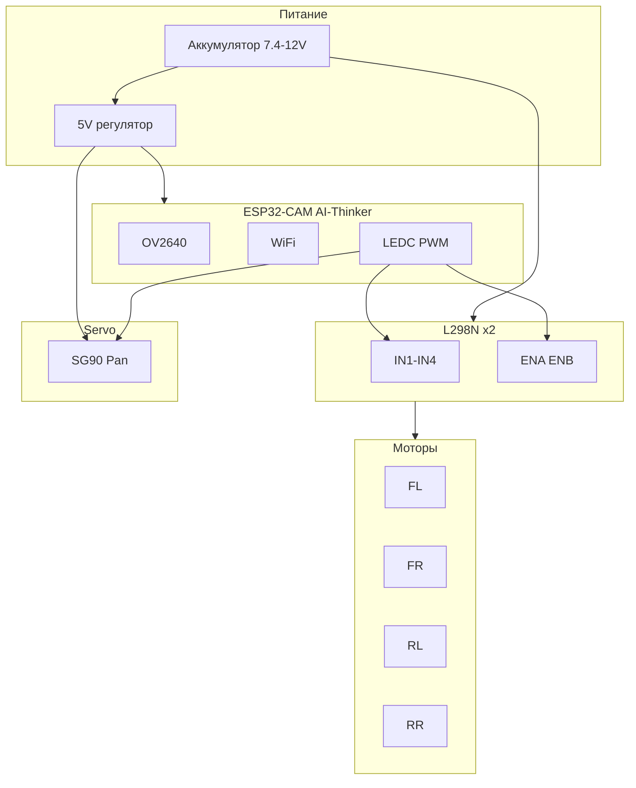

# Аппаратная часть Rover (ESP32-CAM + L298N + SG90)

Руководство по подключению компонентов, питанию и пинам.

## Архитектура проекта



## Таблица пинов ESP32-CAM

| Назначение | GPIO | Конфиг | Примечание |
|------------|------|--------|------------|
| Камера OV2640 | 0,2,4,5,18,19,21,22,23,25,26,27,32,34,35,36,39 | config.h | Заняты |
| IR LED (подсветка) | 4 | PIN_IR_LED | digitalWrite |
| Мотор FL (PWM) | 12 | PWM_PIN_FL | LEDC ch.1 → L298N |
| Мотор FR (PWM) | 13 | PWM_PIN_FR | LEDC ch.2 → L298N |
| Мотор RL (PWM) | 14 | PWM_PIN_RL | LEDC ch.3 → L298N |
| Мотор RR (PWM) | 15 | PWM_PIN_RR | LEDC ch.4 → L298N |
| Servo Pan (PWM) | 2 | SERVO_PIN | LEDC ch.5, 50Hz |

## L298N — подключение

**Роль:** драйвер DC-моторов. Один L298N = 2 канала (2 мотора). Для 4 моторов — 2 платы L298N.

**Питание L298N:**
- `+12V` (или +6V…+35V) — от аккумулятора (рекомендуется 7.4–12V для робота)
- `GND` — общий минус с ESP32 и аккумулятором
- `+5V` — опциональный выход (если не снята перемычка). Ток до ~50 mA — только для логики, не для мощных нагрузок

**Управление (на один канал):**
- `IN1`, `IN2` — направление вращения
- `ENA` (Enable A) — PWM для скорости. Перемычка = 100% скорость

**Маппинг ESP32 → L298N (для 4 колёс):**

| ESP32 GPIO | L298N #1 | L298N #2 |
|------------|----------|----------|
| 12 (FL) | ENA или IN1 | — |
| 13 (FR) | ENB или IN3 | — |
| 14 (RL) | — | ENA или IN1 |
| 15 (RR) | — | ENB или IN3 |

*Точная схема зависит от выбранной топологии (ENA/ENB под PWM или IN под направление). В config.h сейчас — 4 PWM выхода, каждый задаёт скорость одного мотора.*

**Важно:** общий GND между ESP32, L298N и аккумулятором обязателен.

## SG90 — подключение привода поворота камеры

**Провода SG90 (типично):**
- Коричневый/чёрный — GND
- Красный — VCC (+4.8–6V, обычно 5V)
- Оранжевый/жёлтый/белый — сигнал (PWM)

**Подключение:**

| SG90 | ESP32-CAM / питание |
|------|---------------------|
| Сигнал (оранжевый) | GPIO 2 (SERVO_PIN) |
| VCC (красный) | 5V (см. ниже) |
| GND (коричневый) | GND (общий с ESP32) |

**Питание VCC сервы:**

1. **Отдельный 5V источник** (предпочтительно): блок питания 5V 1A или стабилизатор от батареи. SG90 при нагрузке может потреблять до ~0.5–0.7 A.
2. **5V с L298N:** только если не питаете от него ESP32 и нагрузка по 5V небольшая. Ток 5V выхода L298N ограничен.
3. **USB 5V:** только для тестов, при питании ESP32 от USB.

**Рекомендация:** для надёжности — отдельный 5V (1A) или BEC (Battery Eliminator Circuit) от основного аккумулятора.

## Схема питания

```
Аккумулятор 7.4V (2S LiPo)
    ├── L298N (+12V) → моторы
    ├── BEC/регулятор 5V → ESP32-CAM (VIN)
    └── BEC/регулятор 5V → SG90 (VCC)

Все GND соединены вместе.
```

## Где брать компоненты

| Компонент | Где купить | Примечание |
|-----------|------------|------------|
| ESP32-CAM AI-Thinker | AliExpress, Чип и Дип | Проверить PSRAM |
| L298N | AliExpress, Амперка | Китайские клоны — дёшево |
| SG90 | AliExpress, Амперка | Много подделок, лучше брать с металлом |
| BEC 5V 1A | AliExpress, Hobbyking | Для питания ESP32 и сервы |
| Аккумулятор 2S 7.4V | Hobbyking, Лайк | Рекомендуется 1500–2200 mAh |
